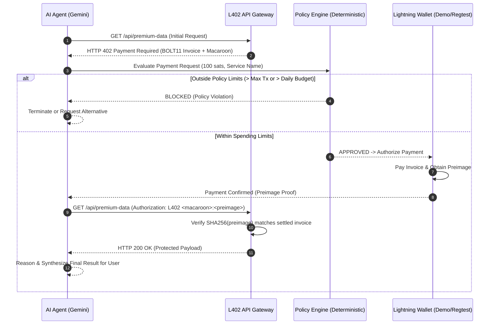

# Machine Money — Autonomous Payments for AI Agents

> **"AI agents can act autonomously. Machine Money gives them a controlled way to pay for the services they need."**
> 
> *Let software pay for the services it needs.*

[](https://opensource.org/licenses/Apache-2.0)
[](https://lightning.engineering)
[](https://ai.google.dev)

---

## 1. The Problem

AI agents are rapidly mastering task planning, tool execution, code generation, and multi-step reasoning. However, when an agent encounters a pay-per-use digital resource—such as proprietary market feeds, GPU inference slots, weather radar, or real-time grid telemetry—the entire execution halts. 

Current systems rely on:
- Hardcoded human credit cards
- Prepaid API keys vulnerable to balance exhaustion or key leaks
- Manual human checkout flows that break autonomous agent execution

## 2. The Solution: Machine Money

**Machine Money** introduces autonomous micro-commerce for AI software using the open **L402 (HTTP 402 Payment Required)** protocol over the Bitcoin Lightning Network, governed by a **deterministic payment policy engine**.

The AI agent does not have unlimited spending authority. Instead:
- **AI decides WHAT it needs.**
- **Policy decides WHETHER it can pay.**
- **Lightning Wallet executes HOW it pays.**



---

## 3. Key Features

- **Standard HTTP 402 Protocol**: Real HTTP status code 402 with `WWW-Authenticate: L402 invoice="...", macaroon="..."` headers.
- **Deterministic Policy Layer**: Decoupled from the LLM prompt. Enforces per-transaction caps, daily budgets, and service allowlists.
- **Dual Payment Rails**:
  - **DEMO MODE**: Zero-setup cryptographic Lightning simulation (instant preimages, virtual wallet).
  - **LIGHTNING REGTEST MODE**: Native connection to Polar, Core Lightning/LND nodes, and LNbits.
- **Gemini 3.8 Flash Tool Calling**: Uses `@google/genai` to allow the model to autonomously invoke the `get_paid_data` tool when encountering tasks requiring pay-per-use APIs.
- **Live Hackathon Demonstration Interface**: Visualizes every transition in the 8-step autonomous payment pipeline in real-time.
- **Developer Python SDK**: Ready-to-import `agent-sdk/client.py` for Python developers to integrate autonomous payments into their own agents in 3 lines of code.

---

## 4. Technology Stack

- **Frontend**: React 19, TypeScript, Tailwind CSS, Lucide Icons, Motion.
- **Backend & Gateway**: Node.js / Express (or Python FastAPI / Uvicorn in `backend/`).
- **AI Orchestration**: Google Gemini 3.8 Flash via `@google/genai` SDK with function declarations.
- **Lightning Protocol**: L402 specification (LSAT), BOLT11 invoices, SHA256 cryptographic preimages.
- **Regtest Layer**: LNbits API adapter + Polar integration support.

---

## 5. Quickstart

### Prerequisites
- Node.js 20+ (for live preview server)
- Python 3.10+ (for Python agent & FastAPI backend)

### Installation
```bash
# Clone the repository
git clone https://github.com/example/machine-money.git
cd machine-money

# Install dependencies
npm install

# Run the dev server on port 3000
npm run dev
```

Visit `http://localhost:3000` to access the developer dashboard.

---

## 6. Running with Lightning Regtest (Polar + LNbits)

To connect Machine Money to a real local Lightning test network:

1. Install and launch **Polar** ([lightningpolar.com](https://lightningpolar.com)).
2. Create a test network with 2 LND nodes and fund a channel between them.
3. Launch LNbits connected to Node 1 (`docker run -p 5000:5000 lnbits/lnbits:latest`).
4. In the Machine Money **Settings** screen:
   - Toggle **Payment Mode** to `LIGHTNING REGTEST`.
   - Set **LNbits URL** to `http://localhost:5000`.
   - Enter your LNbits Admin API Key.
5. All future autonomous payments will route through your local Lightning channels!

---

## 7. Python Agent SDK Usage

```python
from agent_sdk.client import MachineMoneyAgent
from agent_sdk.policy import SpendingPolicy

# 1. Define human spending guardrails
policy = SpendingPolicy(
    max_transaction_sats=200,
    daily_limit_sats=1000,
    allowed_services=["Premium Data API", "Weather API"]
)

# 2. Instantiate payment-enabled agent
agent = MachineMoneyAgent(policy=policy)

# 3. Autonomously pay & fetch protected API
result = agent.pay_and_fetch("http://localhost:3000/api/premium-data")
print("Retrieved Data:", result["data"])
```

---

## 8. API Endpoints

| Method | Endpoint | Description | Status Code |
|---|---|---|---|
| `GET` | `/api/premium-data` | Protected Grid Telemetry API | `402` (unpaid) / `200` (paid) |
| `GET` | `/api/weather-data` | Protected Atmospheric Forecast | `402` (unpaid) / `200` (paid) |
| `GET` | `/api/compute-data` | Protected GPU Inference Slot | `402` (unpaid) / `200` (paid) |
| `GET` | `/api/premium-dataset` | High-Value Dataset (500 sats) | `402` (unpaid) / `200` (paid) |
| `GET` | `/api/agent` | Agent balance, status, & stats | `200` |
| `POST` | `/api/demo/run` | Execute end-to-end payment run | `200` |
| `POST` | `/api/agent/prompt` | Interactive Gemini AI tool flow | `200` |
| `POST` | `/api/policy` | Update spending limits | `200` |
| `POST` | `/api/agent/reset` | Reset demo state & wallet | `200` |

---

## 9. Hackathon Demo Script (3-Minute Presentation)

1. **The Setup**: Show the dashboard. Point out the Agent (*Research Agent*), wallet balance (*1,000 sats*), and policy (*Max: 200 sats/tx*).
2. **The Prompt**: Click **Live Demo** and select *"Get the premium electricity data"* (100 sats).
3. **The Autonomous Loop**: Click **RUN PAYMENT DEMO**. Watch the 8 steps illuminate:
   - Request -> 402 Payment Required -> Invoice extracted -> Deterministic Policy verified -> Lightning payment settled -> Preimage obtained -> Retried with L402 token -> Unlocked 200 OK.
4. **The Policy Guardrail**: Now select *Premium Dataset* (500 sats). Click **RUN PAYMENT DEMO**.
   - Watch the agent stop at Step 4: **BLOCKED BY POLICY** (*500 sats exceeds 200 sats limit*).
   - Point out: *"The LLM cannot hallucinate away the spending limit. The code says no."*
5. **The Ledger**: Open the **Transactions** tab to show judges the immutable cryptographic ledger with preimage proofs and payment hashes.

---

## 10. Security Invariants

- **No Secret Key Exposure**: Wallet keys and API tokens are never sent to the client browser.
- **Deterministic Boundary**: LLMs are never granted direct wallet transaction signing authority.
- **No Real Bitcoin**: The development environment strictly operates in Demo or Regtest mode.
- **Proof-of-Payment Verification**: Protected resources only release content after cryptographic validation of `SHA256(preimage) == payment_hash`.
